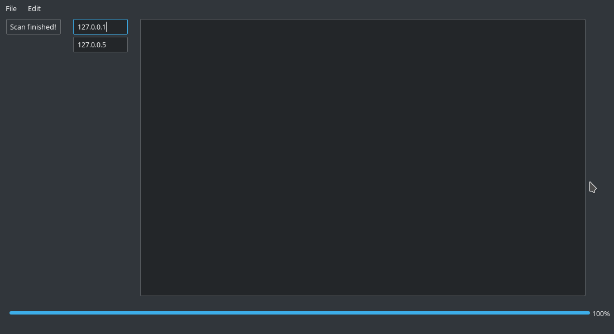

# Router Scan Utility

## What is it?

Router Scan is QT-based utility which designed for bruteforce of routers on IP range.

## Features

## Installation

### 1. Install dependencies

#### Windows:

- Download & install [Python 3+]
- Download & install [PyQT5]

#### Linux:

##### Debian/Ubuntu/Mint

```sh
sudo apt-get install pyqt5
```

##### Arch Linux

```bash
sudo pacman -S pyqt5
```

### 2. Clone repository

```sh
git clone https://github.com/Fantaser99/improvedrs.git
```

*//TODO: Installation script for Windows.*

### 3. Launch 1.py 
*//TODO: Rename 1.py -> main.py or app.py*

## Screenshots



## License

###### *WHAT IS LICENSE?! I DONT HAVE ANY LICENSES! 0_o*

[PyQT5]:https://riverbankcomputing.com/software/pyqt/download5
[Python 3+]:https://www.python.org/downloads/